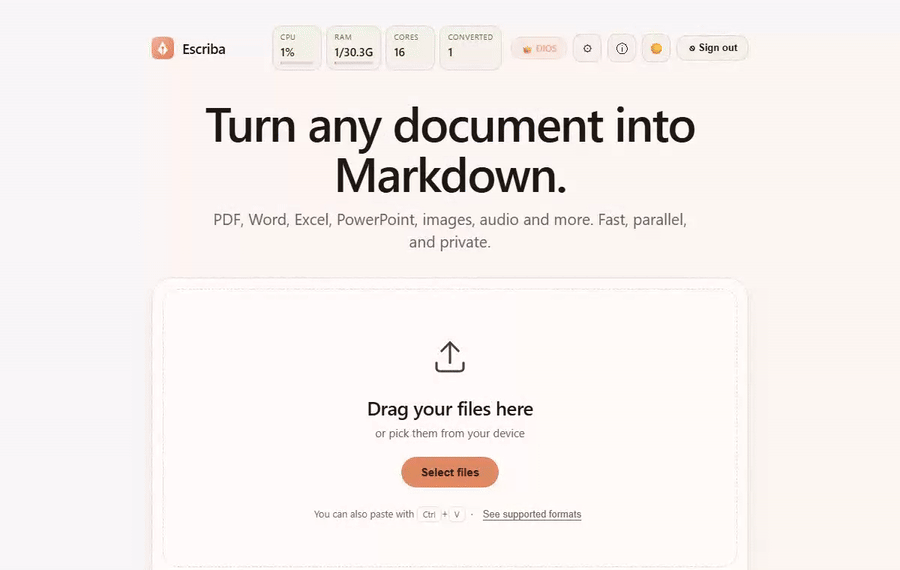

<div align="center">

# ✍️ Escriba

**O tradutor universal para o idioma da IA.**

Transforme qualquer documento em Markdown limpo e anônimo — pronto para qualquer LLM, e exportável para Word, XML e mais. Uma ferramenta auto‑hospedável que resolve as dores de cabeça de alimentar documentos a um LLM: entrada ruidosa e gulosa de tokens → Markdown limpo, vazamento de dados sensíveis → anonimização de PII embutida com pseudonimização reversível, e um painel embutido de preparação para LLM que conta tokens, estima o custo com preços ao vivo, verifica o ajuste à janela de contexto e fragmenta para RAG. Local, em 7 idiomas, construído sobre o [Microsoft MarkItDown](https://github.com/microsoft/markitdown).

[](../../LICENSE)
[](https://github.com/diegoparras/escriba/pkgs/container/escriba)
[](#-internacionalização)




📖 **Manual completo (PDF):** [`docs/Escriba-Manual.pt.pdf`](../Escriba-Manual.pt.pdf)

[English](../../README.md) · [Español](README.es.md) · [Français](README.fr.md) · **Português** · [Italiano](README.it.md) · [中文](README.zh.md) · [日本語](README.ja.md)

</div>

---

## ✨ Recursos

- 📄 **Documentos** — PDF, Word, Excel, PowerPoint, HTML, CSV, EPUB, ZIP e mais.
- 🖼️ **Imagens** — OCR automático (Tesseract); descrição por IA opcional.
- 🎙️🎬 **Áudio e vídeo** — transcrição local e offline com Whisper (mp3, wav, mp4, mov, mkv…).
- 🔗 **URLs e YouTube** — converte uma página web ou obtém a transcrição de um vídeo do YouTube.
- 🔍 **OCR inteligente** — o texto das imagens é reconhecido automaticamente; PDFs digitalizados **e rotacionados** são detectados, processados com OCR e endireitados na hora.
- 📑 **Seleção de páginas** — para PDFs longos, converta apenas as páginas que precisar: um intervalo (`5–67`), páginas individuais (`1, 6, 9`) ou uma combinação (`1, 2, 5‑67`). Escolhida por arquivo com um seletor simples que mostra a contagem de páginas do documento — sem sintaxe para memorizar.
- 🤖 **IA opcional** — OpenAI, Google Gemini (AI Studio) ou OpenRouter, com o padrão **«Sem IA»**. Os modelos são listados automaticamente.
- 🛡️ **Anonimização de PII para LLMs** — motor de privacidade local completo: modelo NER ([OpenAI Privacy Filter](https://github.com/openai/privacy-filter)) + campos de comprovantes por layout + detectores validados (cartão **Luhn**, **IBAN**) + suas próprias regras **RE2**. Cinco modos de saída: *tipado*, *anônimo*, **pseudonimização reversível** («PERSONA_1» → envie ao LLM → reidrate localmente), **mascaramento parcial** (••••-3456) e **hash estável** (mesmo dado → mesmo pseudônimo entre documentos).
- ⬛ **Censura visual** — baixe seu PDF ou imagem digitalizada com os dados **tachados na página**. Redação real: o texto e os pixels abaixo são removidos do arquivo, não cobertos — e os **metadados** do documento (título, autor, palavras‑chave, XMP) também são apagados, para que nada vaze em *Propriedades*.
- 📤 **Exportação para 13 formatos** — além de Markdown, um único menu unificado exporta o resultado para **Word (.docx)**, ODT, EPUB, HTML, LaTeX, reStructuredText e **XML** estruturado (DocBook, JATS, TEI, OPML) via [Pandoc](https://pandoc.org/), além dos formatos de dados **JSON**, **YAML** e **[TOON](https://github.com/toon-format/toon)** (compacto e eficiente em tokens para LLMs). Sem nenhum LLM envolvido.
- 🔊 **Texto para áudio (podcast)** — transforme o documento convertido em um **MP3**: uma **narração** com voz única ou um **podcast com dois apresentadores** roteirizado por IA. Vozes locais do [Piper](https://github.com/rhasspy/piper) (offline, 14 vozes em es/en/pt/fr/it/de/zh) ou vozes opcionais na nuvem da **OpenAI**, com controles de tom / velocidade / volume.
- ✏️ **Editor Markdown integrado** — abra o resultado em um **editor em tela cheia com pré-visualização ao vivo** para limpá-lo antes de exportar ou narrar. Suas edições se propagam para cada saída (Word, XML, MP3…).
- 🧠 **Painel de preparação para LLM** — cada conversão mostra a **contagem de tokens** (tiktoken), os **tokens e o custo economizados** pela anonimização, uma **estimativa de custo por modelo ao vivo** (preços obtidos do [OpenRouter](https://openrouter.ai/)), o **ajuste à janela de contexto** em centenas de modelos, **fragmentação para RAG** com um clique e um **detector de injeção de prompt**. Tudo local, sem chamadas de IA.
- 🔬 **Extração avançada de PDF** — motor opcional [OpenDataLoader](https://github.com/opendataloader-project/opendataloader-pdf) para layouts complexos: melhor ordem de leitura (XY-Cut++) e hierarquia de títulos, com fallback automático para o extrator padrão.
- 🌍 **7 idiomas na interface** — English, Español, Français, Português, Italiano, 中文, 日本語 (detectados automaticamente, alternáveis).
- 👑😇👤 **Três níveis de acesso** — DIOS / ANGEL / HUMANO, cada um com sua senha e limites.
- 🔒 **Privado por design** — os arquivos enviados são apagados logo após a conversão; nada é armazenado.
- 🛡️ **Reforçado** — anti‑SSRF, sanitização XSS, limite de requisições por papel, contêiner sem root, cabeçalhos de segurança.
- 🐳 **Uma única imagem autossuficiente** — ffmpeg, OCR, Whisper e Redis incluídos. Sem serviços extras.

---

## 🚀 Início rápido

Baixe a imagem pronta e execute com um único comando:

```bash
docker run -d --name escriba --restart unless-stopped -p 8000:8000 \
  -e SECRET_KEY="$(openssl rand -hex 32)" \
  -e GOD_PASSWORD="troque-isto" \
  ghcr.io/diegoparras/escriba:latest
```

Abra **http://localhost:8000** e entre com a `GOD_PASSWORD` que você definiu.

> A imagem inclui tudo (ffmpeg, Tesseract OCR, Whisper, Redis embutido). Nenhum serviço extra é necessário.

---

## 🛳️ Implantação

Escolha a sua plataforma. Tudo roda a partir da imagem acima.

> Antes de começar, copie `.env.example` para `.env` e defina seus segredos
> (`SECRET_KEY`, `GOD_PASSWORD`, …). Gere chaves com `openssl rand -hex 32`.

<details open>
<summary><b>EasyPanel</b></summary>

1. **Project → + Service → App**, e em **Source → Docker Image** coloque `ghcr.io/diegoparras/escriba:latest`.
2. Adicione suas **variáveis de ambiente** (ver [Configuração](#-configuração)).
3. Em **Domains**, defina **Container Port `8000`**, adicione seu domínio e ative HTTPS.
4. **Deploy.**
</details>

<details>
<summary><b>Docker Compose</b></summary>

```bash
git clone https://github.com/diegoparras/escriba.git
cd escriba
cp .env.example .env          # defina seus segredos
docker compose up -d --build
```
</details>

<details>
<summary><b>Portainer</b></summary>

**Stacks → Add stack → Repository** com
`https://github.com/diegoparras/escriba` e o caminho de compose `docker-compose.yml`
(ou cole o `docker-compose.yml` no editor web). Defina as variáveis de ambiente e
implante; o app escuta na porta `8000`.
</details>

<details>
<summary><b>Dokploy</b></summary>

**Create Application → GitHub** (repo `diegoparras/escriba`) com **Build Type:
Dockerfile**, adicione suas variáveis de ambiente, defina o domínio com **Container
Port `8000`** e HTTPS, e implante.
</details>

<details>
<summary><b>Docker puro / proxy reverso</b></summary>

```bash
docker build -t escriba .
docker run -d --name escriba --restart unless-stopped -p 8000:8000 \
  -e SECRET_KEY="$(openssl rand -hex 32)" -e GOD_PASSWORD="troque-isto" escriba
```

Para TLS, coloque um proxy reverso na frente. Exemplo de `Caddyfile` (HTTPS automático):

```caddy
exemplo.com {
    reverse_proxy localhost:8000
}
```

Com Nginx, faça proxy para `localhost:8000` e aumente `client_max_body_size` para envios grandes.
</details>

---

## ⚙️ Configuração

Todas as configurações são variáveis de ambiente. Mínimo recomendado:

```env
SECRET_KEY=<openssl rand -hex 32>   # obrigatório em produção (senão as sessões reiniciam)
GOD_PASSWORD=<uma senha forte>
ANGEL_PASSWORD=<opcional>
HUMAN_PASSWORD=<opcional>
```

Se nenhuma senha for definida, uma `GOD_PASSWORD` aleatória é gerada na inicialização
e impressa nos **logs** do contêiner.

| Variável | Padrão | Descrição |
|---|---|---|
| `SECRET_KEY` | *(aleatória)* | Chave de assinatura das sessões. **Defina‑a** em produção. |
| `GOD_PASSWORD` / `ANGEL_PASSWORD` / `HUMAN_PASSWORD` | — | Senha de cada nível de acesso. |
| `HUMAN_OPEN` | `false` | Permite o nível HUMANO sem login (conversor público). |
| `WEB_CONCURRENCY` | `auto` | Workers paralelos. `auto` = número de núcleos da CPU. |
| `MAX_UPLOAD_MB` | `100` | Limite absoluto de upload (exceto DIOS). |
| `WHISPER_MODEL` | `base` | Modelo de transcrição: `tiny` · `base` · `small` · `medium` · `large-v3`. |
| `MAX_MEDIA_MINUTES` | `120` | Duração máx. de áudio/vídeo a transcrever (`0` = ilimitado; DIOS sem limite). |
| `OPENAI_API_KEY` / `OPENROUTER_API_KEY` / `GOOGLE_API_KEY` | — | Chaves de IA do servidor (usadas se o usuário não fornecer a sua). Apenas DIOS e ANGEL. |
| `API_TOKEN` / `API_TOKEN_ROLE` | — / `angel` | Token estático para automação (n8n, scripts) e o papel atribuído. |
| `EMBEDDED_REDIS` | `true` | Redis embutido para o limite de requisições compartilhado. `false` + `REDIS_URL` para externo. |
| `ENABLE_DOCS` | `false` | Expor Swagger em `/api/docs`. |
| `PORT` | `8000` | Porta do contêiner. |

Os limites por nível (`*_MAX_MB`, `*_MAX_BATCH`, `*_RATE`) e presets estão documentados em
[`.env.example`](../../.env.example).

**Desempenho:** por padrão o app cria um worker por núcleo de CPU, adaptando‑se a
qualquer servidor (VPS de 1 núcleo → 1 worker; servidor de 24 threads → 24). Cada worker usa
~250 MB de RAM; defina `WEB_CONCURRENCY` com um número fixo para limitar.

---

## 🔐 Papéis e níveis de acesso

O login é obrigatório. Cada nível tem sua própria senha e limites.

| Capacidade | 👤 HUMANO | 😇 ANGEL | 👑 DIOS |
|---|:---:|:---:|:---:|
| Enviar e converter arquivos | ✓ | ✓ | ✓ |
| Converter de uma URL pública | — | ✓ (anti‑SSRF) | ✓ |
| URL interna / `file://` / caminho local | — | — | ✓ |
| Áudio / vídeo / ZIP | — | ✓ | ✓ |
| Transcrições do YouTube | ✓ | ✓ | ✓ |
| OCR (forçado / automático) | — | ✓ | ✓ |
| Usar as chaves de IA do servidor | — | ✓ | ✓ |
| Tamanho máx. de arquivo | 25 MB | 100 MB | ilimitado |
| Arquivos por lote | 3 | 10 | ilimitado |
| Estatísticas do servidor (CPU/RAM) | — | parcial | completo |
| Limite de requisições (req/min) | 15 | 60 | ilimitado |

Todos os limites são configuráveis por variáveis de ambiente.

**Destaques de segurança:** acesso a arquivos locais e SSRF restritos ao DIOS;
o download de URLs bloqueia IPs internos e redirecionamentos; uploads limitados por streaming;
a pré‑visualização é sanitizada com DOMPurify; CSP e cabeçalhos de segurança aplicados; o
contêiner roda como usuário não‑root com `no-new-privileges`; o limite de requisições é
compartilhado entre workers via o Redis embutido.

---

## 📤 Exportação além do Markdown

O Markdown limpo é o núcleo, mas o **único menu «Formato…»** do cartão de resultado o transforma no que seu fluxo de trabalho precisar — escolha um formato e clique em **Baixar** (nunca dispara sozinho). Com o [Pandoc](https://pandoc.org/), sem nenhum LLM envolvido:

| Família | Formatos |
|---|---|
| Markdown | `.md`, compacto (sem espaços em branco), fragmentos para RAG (`.jsonl`) |
| Office e ebook | **Word `.docx`**, ODT, EPUB |
| Web e diagramação | HTML, LaTeX, reStructuredText |
| XML estruturado | **DocBook**, **JATS**, **TEI**, **OPML** |
| Privacidade | PDF censurado (PII tachado — ver acima) |

## 🧠 Painel de preparação para LLM

Cada conversão vem com um painel compacto que deixa o texto pronto para um modelo — inteiramente local, com zero chamadas de IA:

- **Contagem de tokens** com `tiktoken` (`o200k_base`, embutido na imagem — funciona offline).
- **Tokens e custo economizados** pela anonimização, para que você veja o que remover PII lhe rende.
- **Estimativa de custo por modelo ao vivo** — preços e janelas de contexto obtidos do [OpenRouter](https://openrouter.ai/) (centenas de modelos, em cache) para que os números nunca fiquem desatualizados.
- **Ajuste à janela de contexto** — num relance, em quais modelos o documento cabe.
- **Fragmentação para RAG com um clique** — divide em fragmentos sobrepostos e limitados por tokens (`semchunk`), baixáveis como `.jsonl`.
- **Detector de injeção de prompt** — sinaliza texto que tenta sequestrar um LLM posterior.

---

## 🔌 API

Útil para automação (n8n, scripts). Requer autenticação.

**Com um token de API** (defina `API_TOKEN`):

```bash
curl -H "X-API-Key: SEU_TOKEN" \
     -F "file=@documento.pdf" \
     https://seu-dominio/api/convert
# Forçar OCR / idioma:  -F "ocr=true"  -F "lang=pt-BR"
```

**Com um cookie de sessão:**

```bash
curl -c cookies.txt -F "password=$GOD_PASSWORD" https://seu-dominio/api/login
curl -b cookies.txt -F "file=@documento.pdf"    https://seu-dominio/api/convert
```

`POST /api/convert` (multipart/form-data): `file` *ou* `url`, mais os opcionais `lang`,
`ocr`, `llm_provider`, `llm_api_key`, `llm_model`. Resposta:

```json
{ "source": "…", "title": "…", "markdown": "…",
  "words": 1234, "chars": 5678, "elapsed_ms": 87,
  "pdf_type": "digitalizado", "ocr_applied": true, "note": null }
```

`POST /api/redact` (multipart/form-data): `file` (PDF ou imagem), opcionais `lang`, `anon_strict`, `anon_detectors`, `anon_rules`. Retorna o **PDF censurado** (binário) com o cabeçalho `X-Redacted-Entities`.

Pós‑processamento de Markdown (JSON na entrada, JSON ou arquivo na saída):

| Endpoint | Método | Descrição |
|---|---|---|
| `/api/export` | POST | Converte Markdown para um formato de destino (`docx`, `odt`, `epub`, `html`, `latex`, `rst`, `docbook`, `jats`, `tei`, `opml`). |
| `/api/compact` | POST | Markdown sem espaços em branco para economizar tokens. |
| `/api/chunk` | POST | Fragmentos para RAG limitados por tokens (retorna `.jsonl`). |
| `/api/model_prices` | GET | Preços e janelas de contexto dos modelos ao vivo (OpenRouter, em cache). |

---

## 🌍 Internacionalização

A interface vem em **7 idiomas** — English, Español, Français, Português, Italiano,
中文 e 日本語. O idioma é detectado automaticamente pelo navegador e pode ser alterado a
qualquer momento no painel ⚙️; a escolha é lembrada por navegador.

---

## 💻 Desenvolvimento local

```bash
pip install -r requirements.txt
uvicorn app.main:app --reload --port 8000
```

> OCR e transcrição precisam de `ffmpeg`, `tesseract-ocr` e `ocrmypdf` instalados no
> sistema (a imagem Docker já os inclui). Os demais formatos funcionam sem eles.

---

## 📜 Créditos e licença

**Escriba** — desenvolvido por **Diego Parrás**
CeMIACE · SEUBES · FCE‑UBA (Facultad de Ciencias Económicas, Universidad de Buenos Aires).

Construído sobre [Microsoft MarkItDown](https://github.com/microsoft/markitdown),
[FastAPI](https://fastapi.tiangolo.com/),
[Tesseract OCR](https://github.com/tesseract-ocr/tesseract),
[OCRmyPDF](https://github.com/ocrmypdf/OCRmyPDF) e
[faster‑whisper](https://github.com/SYSTRAN/faster-whisper).
Sob a [Licença MIT](../../LICENSE).
